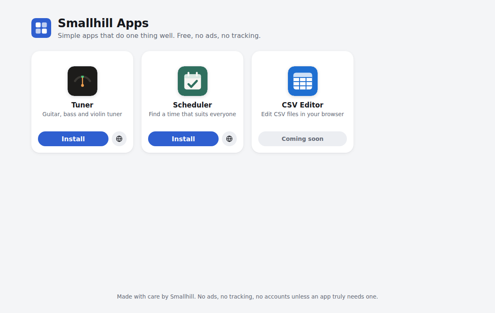
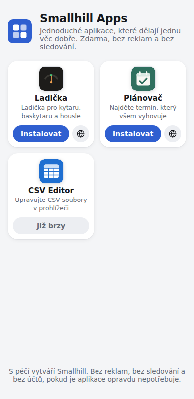

# Smallhill Apps portal

App store style home page of https://apps.smallhill.cz listing all Smallhill apps as tiles. Each tile has an Install button using the experimental [Web Install API](https://github.com/WICG/web-install) (`navigator.install`) and a globe button that opens the app in the browser. Clicking a tile opens details with mobile screenshots and a description (`/#<app-id>` links straight to them).

Browsers without `navigator.install` get a short hint on how to install the app from the browser menu.

## Adding an app

1. Put its logo (`icon.svg`) and mobile screenshots (390×780, `.webp`) into `public/apps/<id>/`.
2. Add an entry to `src/app/apps.ts`. Leave out `url` to show it as coming soon, set `listed: false` to hide it.

## Development

```sh
npm install
npm start
```



